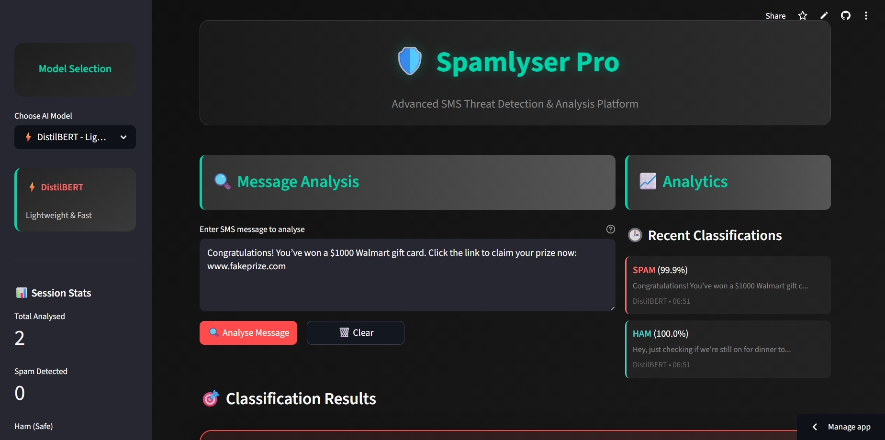
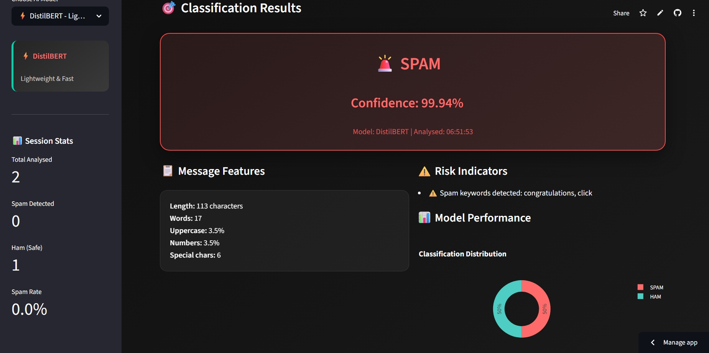

<div align="center"></div>

<h1 align="center">SPAMLYSER</h1>


<h4>🛡️ Advanced SMS Spam Detection & Analysis with Transformers</h4>


<h3>📖 Table of Contents</h3> 

- <a href="#overview"> Overview </a>
- <a href="#project-insights"> Project Insights </a>
- <a href="#demo"> Live Demo </a>
- <a href="#screenshots"> Screenshots </a>
- <a href="#features">Features</a>
- <a href="#models-used">Models Used</a>
- <a href="#video-explanation">Video Explanation</a>
- <a href="#technologies-used"> Technologies Used </a>
- <a href="#installation-setup"> Installation & Setup </a>
- <a href="#example-usage"> Example Usage </a>
- <a href="#acknowledgments">Acknowledgments</a>
- <a href="#contact">Contact</a>
- <a href="#how-to-contribute">How to Contribute</a>
- <a href="#contributing">Contributing</a>
- <a href="#code-of-conduct">Code of Conduct</a>
- <a href="#contribution-guidelines">Contribution Guidelines</a>
- <a href="#suggestions-feedback"> Suggestions & Feedback</a>
- <a href="#show-your-support">Show Your Support</a>
- <a href="#license">License</a>
- <a href="#stargazers">Stargazers</a>
- <a href="#forkers">Forkers</a>
- <a href="#project-admin">Project Admin</a>


<h2 id="overview">🔍 Overview</h2>

> **Spamlyser Pro** is a powerful, real-time SMS spam detection platform built with **Streamlit** and **Transformers**, backed by 4 custom-trained LLM backbones **DistilBERT**, **BERT**, **RoBERTa**, and **ALBERT**. It allows users to classify SMS messages as *SPAM* or *HAM*, visualise spam distribution, and analyse risky message features with an elegant, responsive UI.


<div align="center">
  
</div>


<h2 id="project-insights">📊 Project Insights</h2>

<table align="center">
    <thead align="center">
        <tr>
            <td><b>🌟 Stars</b></td>
            <td><b>🍴 Forks</b></td>
            <td><b>🐛 Issues</b></td>
            <td><b>🔔 Open PRs</b></td>
            <td><b>🔕 Closed PRs</b></td>
            <td><b>🛠️ Languages</b></td>
            <td><b>👥 Contributors</b></td>
        </tr>
     </thead>
    <tbody>
         <tr>
            <td></td>
            <td></td>
            <td></td>
            <td></td>
            <td></td>
            <td></td>
            <td></td>
        </tr>
    </tbody>
</table>


<h2 id="demo">🚀 Live Demo</h2>

Experience Spamlyser live here: 
<br>
👉 [](https://www.google.com/search?q=https://Spamlyser.streamlit.app)


[](https://github.com/ellerbrock/open-source-badges/)


<h2 id="screenshots"> 📸 Screenshots </h2>

<div align="center"></div>
<div align="center"></div>


<h2 id="features"> 🌟 Features </h2>

### 🤖 Transformer-Based Classification

* Compare performance across 4 LLM backbones (DistilBERT, BERT, RoBERTa, ALBERT)
* Trained on [HuggingFace’s `sms_spam`](https://huggingface.co/datasets/sms_spam) dataset
* Real-time predictions with confidence scores

### 🔍 Message Feature Analysis

* Length, word count, digit and symbol ratio
* URL and phone number detection
* Uppercase and punctuation overuse analysis

### ⚠️ Risk Indicators

* Flags spam indicators (e.g., URLs, ALL CAPS, exclamations, spam keywords)
* Visual threat insights for each message

### 📊 Live Performance Metrics

* Session-based spam/ham distribution pie charts
* Model-wise classification count tracking

### � Recent Additions (GSSoC 2025)

* Responsive dark mode toggle in sidebar for professional UI
* Unified blue theme for both dark and light modes
* Pytest-based unit testing setup (`tests/` folder)
* Dockerfile and CI/CD workflow for easy deployment and automated testing


🌟 **Exciting News...**

🚀 This project is now an official part of GirlScript Summer of Code – GSSoC'25! 💃🎉💻 We're thrilled to welcome contributors from all over India and beyond to collaborate, build, and grow *Spamlyser!* Let’s make learning and career development smarter – together! 🌟👨‍💻👩‍💻

👩‍💻 GSSoC is one of India’s **largest 3-month-long open-source programs** that encourages developers of all levels to contribute to real-world projects 🌍 while learning, collaborating, and growing together. 🌱

🌈 With **mentorship, community support**, and **collaborative coding**, it's the perfect platform for developers to:

- ✨ Improve their skills
- 🤝 Contribute to impactful projects
- 🏆 Get recognized for their work
- 📜 Receive certificates and swag!

🎉 **I can’t wait to welcome new contributors** from GSSoC 2025 to this Spamlyser project family! Let's build, learn, and grow together — one commit at a time. 🔥👨‍💻👩‍💻


<h2 id="models-used"> 🧠 Models Used</h2>

| Model      | Repo URL                                                                        | Characteristics     |
| ---------- | ------------------------------------------------------------------------------- | ------------------- |
| DistilBERT | [🔗 Link](https://huggingface.co/mreccentric/distilbert-base-uncased-spamlyser) | Lightweight & Fast  |
| BERT       | [🔗 Link](https://huggingface.co/mreccentric/bert-base-uncased-spamlyser)       | Balanced & Standard |
| RoBERTa    | [🔗 Link](https://huggingface.co/mreccentric/roberta-base-spamlyser)            | Robust & Accurate   |
| ALBERT     | [🔗 Link](https://huggingface.co/mreccentric/albert-base-v2-spamlyser)          | Efficient & Compact |


<h2 id="video-explanation">📺 Video Explanation</h2>

For a detailed walkthrough of Spamlyser's features and how to use them, check out this video:

**[Insert YouTube Video Link Here]**


<h2 id="technologies-used">🛠️ Technologies Used</h2>

| Tool/Library         | Purpose                             |
| -------------------- | ----------------------------------- |
| **Python**           | Core backend                        |
| **Streamlit**        | Web app interface                   |
| **Transformers**     | Model loading and inference         |
| **Hugging Face Hub** | Model hosting & deployment          |
| **Pandas & Plotly**  | Data processing & visualization     |
| **Regex, Pathlib**   | Feature engineering & file handling |


<h2 id="installation-setup"> ⚙️ Installation and Setup</h2>

> Clone and run locally using Python and Streamlit.

1. **Clone the repository:**

   ```bash
   git clone https://github.com/eccentriccoder01/Spamlyser.git
   cd Spamlyser
   ```

2. **Install dependencies:**

   ```bash
   pip install -r requirements.txt
   ```

3. **Run the app:**

   ```bash
   streamlit run app.py
   ```


<h2 id="example-usage">🚀 Example Usage</h2>

Once the app is running, it will open in your browser at  
👉 [http://localhost:8501](http://localhost:8501)

Now you can try Spamlyser in a few different ways:

---

### 🔹 (i). Analyze a sample message  
- Use the **dropdown menu** in the app.  
- Pick any example message (e.g., “You won a free prize 🎉”).  
- Spamlyser will instantly tell you if it’s **Spam** or **Not Spam**.  

---

### 🔹 (ii). Try your own message  
- Find the text box that says *“Enter your message here”*.  
- Type any message you like (e.g., “Hey, are we meeting later?”).  
- Hit **Analyze** → see the live result right away!  

---

### 🔹 (iii). Test with the sample dataset  
Want to analyze multiple messages at once?  
- Click **Browse files** in the app.  
- Select the file: `sample_data.csv` (already included in the project folder).  
- Spamlyser will process the entire file and show which ones are spam vs. safe.  

📊 You’ll see results in a neat table and charts — super useful for quick testing!  


✨ That’s it — you’ve successfully used Spamlyser!


## Issue Creation ✴

Report bugs and issues or propose improvements through our GitHub repository's "Issues" tab.


## Contribution Guidelines 📑

- Firstly Star(⭐) the Repository
- Fork the Repository and create a new branch for any updates/changes/issue you are working on.
- Start Coding and do changes.
- Commit your changes
- Create a Pull Request which will be reviewed and suggestions would be added to improve it.
- Add Screenshots and updated website links to help us understand what changes is all about.


## Contributing is fun🧡

We welcome all contributions and suggestions!
Whether it's a new feature, design improvement, or a bug fix - your voice matters 💜

Your insights are invaluable to us. Reach out to us team for any inquiries, feedback, or concerns.


<h2 id="acknowledgments">🙏 Acknowledgments</h2>

- Thanks to all contributors of this project 
- Special shoutout to **GirlScript Summer of Code (GSSoC’25)** for the amazing community and support!
- Built with dedication, collaboration, and lots of chai


<h2 id="contact">📞 Contact</h2>

- **Developed by [Eccentric Explorer](https://eccentriccoder01.github.io/Me)**
- **GitHub Issues**: [Report bugs or request features](https://github.com/eccentriccoder01/Spamlyser/issues)
- **Email**: Contact the maintainers for collaboration opportunities

*Feel free to reach out with any questions or feedback!*


<h2 id="how-to-contribute">🤝How to Contribute</h2>

We love contributions from the community! Whether it's a bug report, a new feature, or a documentation improvement, we appreciate your help.

***How to Contribute***

1.  **Fork the repository** and create a new branch for your changes.
2.  **Make your changes** and ensure everything is working as expected.
3.  **Submit a pull request** with a clear description of your changes.

***Found a Bug?***

-   Check the [issue tracker](https://github.com/eccentriccoder01/Spamlyser/issues) to see if the bug has already been reported.
-   If not, open a new issue and provide as much detail as possible.

***Have a Feature Idea?***

-   We'd love to hear it! Open an issue to discuss your idea.


<h2 id="contributing">🤝 Contributing</h2>

We welcome contributions from developers of all skill levels! Here are some ways you can contribute:

### Ways to Contribute

- 🐛 Bug fixes - Help us identify and fix bugs
- ✨ New features - Suggest and implement new functionality
- 📚 Documentation - Improve our docs and guides
- 🎨 UI/UX improvements - Make the platform more user-friendly
- 🔧 Performance optimizations - Help make Spamlyser faster and more efficient
- 📱 Mobile responsiveness - Improve the mobile experience
- 🔒 Security enhancements - Help keep user data safe

*Thank you to everyone who has made Spamlyser better! 💚*


<h2 id="code-of-conduct">📜 Code of Conduct</h2>

Please refer to the [`Code of Conduct`](https://github.com/eccentriccoder01/Spamlyser/blob/master/CODE_OF_CONDUCT.md) for details on contributing guidelines and community standards.


<h2 id="contribution-guidelines">🤝👤 Contribution Guidelines</h2>

We love our contributors! If you'd like to help, please check out our [`CONTRIBUTE.md`](https://github.com/eccentriccoder01/Spamlyser/blob/master/CONTRIBUTING.md) file for guidelines.

>Thank you once again to all our contributors who has contributed to **Spamlyser!** Your efforts are truly appreciated. 💖👏

<!-- Contributors badge (auto-updating) -->

[](https://github.com/eccentriccoder01/Spamlyser/contributors)

<!-- Contributors avatars (auto-updating) -->
<p align="left">
  <a href="https://github.com/eccentriccoder01/Spamlyser/graphs/contributors">
    
  </a>
</p>

See the full list of contributors and their contributions on the [`GitHub Contributors Graph`](https://github.com/eccentriccoder01/Spamlyser/graphs/contributors).


<h2 align="center">
<p style="font-family:var(--ff-philosopher);font-size:3rem;"><b> Show some  by starring this awesome repository!
</p>
</h2>


<h2 id="suggestions-feedback">💡 Suggestions & Feedback</h2>

Feel free to open issues or discussions if you have any feedback, feature suggestions, or want to collaborate!


<h2 id="show-your-support">🙌 Show Your Support</h2>

*If you find Spamlyser project helpful, give it a star! ⭐ to support more such educational initiatives:*

- ⭐ **Starring the repository**
- 🐦 **Sharing on social media**
- 💬 **Telling your friends and colleagues**
- 🤝 **Contributing to the project**


<h2 id="license">📄 License</h2>

This project is licensed under the MIT License - see the [`License`](https://github.com/eccentriccoder01/Spamlyser/blob/master/LICENSE) file for details.


<h2 id="stargazers">⭐ Stargazers</h2>

<div align="center">
  <a href="https://github.com/eccentriccoder01/Spamlyser/stargazers">
    
  </a>
</div>


<h2 id="forkers">🍴 Forkers</h2>

<div align="center">
  <a href="https://github.com/eccentriccoder01/Spamlyser/members">
    
  </a>
</div>


<h2 id="project-admin" align="center">🧑‍💻Project Admin:</h2>
<table>
<tr>
<td align="center">
<a href="https://github.com/eccentriccoder01"></a><br><sub><b>Sagnik Chakraborty</b><br><a href="https://www.linkedin.com/in/eccentricexplorer"></a>
</sub>
</td>
</tr>
</table>


<h2 align="center">👨‍🏫Mentors –  Spamlyser (GSSoC'25)</h2>

| Role          | Name               | GitHub Profile                                      | LinkedIn Profile                                                        |
| ------------- | ------------------ | --------------------------------------------------- | ----------------------------------------------------------------------- |
| Mentor 1 | Shaanif Ahmed |  | [shaanif-ahmed](https://www.linkedin.com/in/shaanif-ahmed-765934233/) |


<h1 align="center"> Give us a Star and let's make magic! </h1>

<p align="center">
     
</p>


<h3 align="center"> 👨‍💻 Built with ❤️ by Spamlyser Team</h3>
<h4 align="center"> ❤️ Sagnik Chakraborty and Contributors ❤️ </h4>
<p align="center">
  <a href="https://github.com/eccentriccoder01/Spamlyser/issues">Open an Issue</a> | <a href="https://github.com/eccentriccoder01/Spamlyser">🌟 Star on GitHub</a> | <a href="https://spamlyser.streamlit.app/">🚀 Live Demo</a></p>


<p align="center">
  <a href="#top" style="font-size: 18px; padding: 8px 16px; display: inline-block; border: 1px solid #ccc; border-radius: 6px; text-decoration: none;">
    ⬆️ Back to Top
  </a>
</p>


> Ready to show off your coding achievements? Get started with **Spamlyser** today! 🚀
